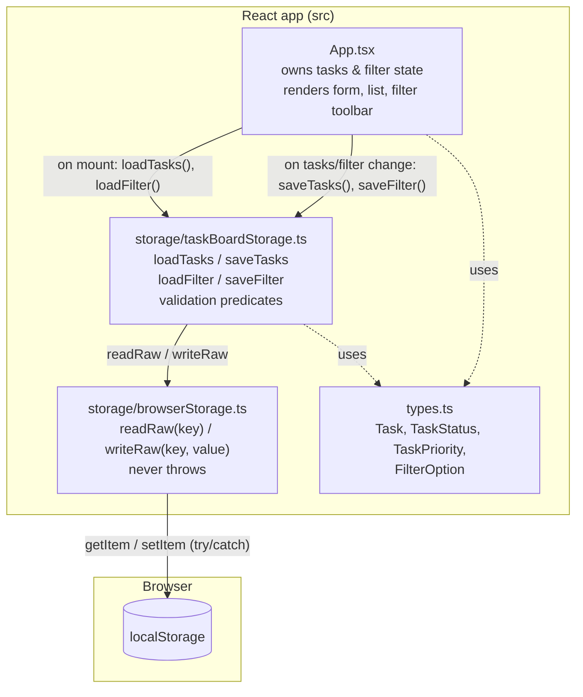
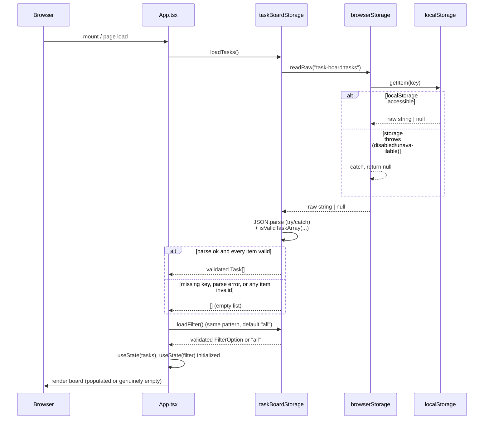
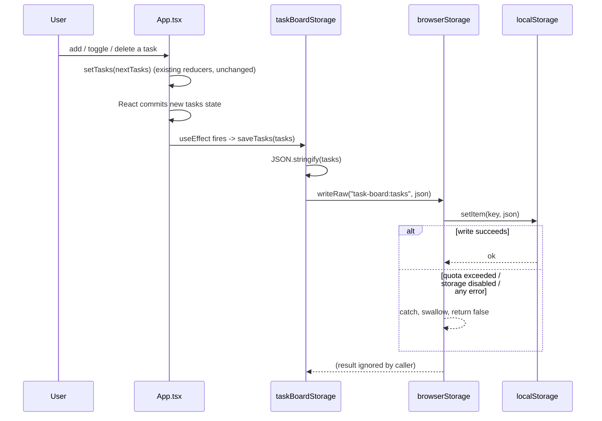

# Architecture: Persist Task Board Between Sessions

## Recommendation

Keep the app a single-page, client-only React component tree (no backend, no state
library, no routing changes). Add one new, framework-agnostic **storage module**
that owns all `localStorage` access, parsing, and validation, and let `App.tsx`
continue to own the React state exactly as it does today — it just initializes
that state from the storage module and writes back to it via two small
`useEffect` hooks (one for tasks, one for filter).

Controlling design decisions:

1. **No custom hook layer, no state library.** `App.tsx` already owns `tasks`
   and `filter` via `useState`. The only change is *where the initial value
   comes from* (a loader function instead of a hardcoded array) and *what
   happens after each update* (a persist call). Introducing a reducer, context,
   or a generic `usePersistedState` hook would add indirection this two-piece
   state model does not need. If the app later grows more persisted fields, a
   generic `usePersistedState<T>(key, initial, validate)` hook is the natural
   next refactor (see Open Decisions) — it is deliberately not built now
   ("smallest architecture that satisfies the requirements").
2. **Persistence logic lives outside React**, in a plain TypeScript module
   (`src/storage/taskBoardStorage.ts`), so save/load/validate can be unit
   tested (or reasoned about) without rendering a component, and so the
   validation rules from FR-008 are expressed as pure, table-testable
   predicates.
3. **All raw `localStorage` calls are isolated behind a tiny wrapper**
   (`src/storage/browserStorage.ts`) that never throws. This is the single
   place that satisfies FR-010/AC-006 ("unavailable, disabled, full, or a
   read/write operation fails ⇒ silently keep working in memory"). Every
   other module only calls this wrapper, so no other code needs its own
   `try/catch` around `window.localStorage`.
4. **Two independent storage keys** — one for the task array, one for the
   filter — rather than one combined JSON blob. This mirrors the requirements'
   own separation of triggers (FR-001/002 save tasks; FR-003 saves the filter)
   and means a corrupted/missing filter entry never forces the valid task list
   to be discarded, and vice versa (simpler alternative considered: a single
   `{ tasks, filter }` blob under one key — rejected because it couples two
   independently-validated, independently-triggered pieces of data and offers
   no benefit at this scale).
5. **No version/schema field is written or read**, per BR-002. Invalid or
   unrecognized shapes are simply treated as "no data" (FR-008/FR-009) rather
   than triggering a migration path.

## Architecture Diagram



## Components and Responsibilities

| Component | File | Responsibility |
| --- | --- | --- |
| `App` (existing, modified) | `src/App.tsx` | Owns `tasks` and `filter` React state. Renders the form, filter toolbar, and task list (unchanged UI/behavior). Initializes state from the storage module instead of a hardcoded array. Calls the storage module's save functions in response to state changes. Contains **no** parsing, validation, or `localStorage` access itself. |
| Task board storage service | `src/storage/taskBoardStorage.ts` (new) | Pure(-ish) domain module: `loadTasks()`, `saveTasks(tasks)`, `loadFilter()`, `saveFilter(filter)`. Serializes tasks/filter to JSON, calls the browser storage wrapper, and validates anything read back per FR-008 before handing it to `App`. This is where "malformed → fallback to empty" (FR-009/AC-005) is decided. |
| Browser storage wrapper | `src/storage/browserStorage.ts` (new) | The **only** place that touches `window.localStorage`. Wraps `getItem`/`setItem` in `try/catch` (and guards the `window.localStorage` property access itself, since some environments throw just accessing it). Returns `null`/`false` on any failure instead of throwing, so callers never need their own error handling. This is what makes FR-010/AC-006 (silent in-memory fallback) hold everywhere, not just in one call site. |
| Shared domain types | `src/types.ts` (new, extracted from `App.tsx`) | `Task`, `TaskStatus` (`'open' \| 'done'`), `TaskPriority` (`'Low' \| 'Medium' \| 'High'`), `FilterOption` (`'all' \| 'open' \| 'done'`). Extracted so the storage module and `App.tsx` share one definition instead of re-deriving the filter type from `Task['status']`. |
| Existing styling | `src/App.css`, `src/index.css` | Unchanged. No new UI states are required — the empty-state paragraph already used for "No tasks match this filter" doubles as the empty-state display for FR-007/AC-004. |

**State ownership stays exactly where it is today**: `App.tsx` is the single
source of truth for in-memory `tasks` and `filter`. The storage module never
holds state of its own; it only reads/writes on demand when `App` calls it.
This avoids a second source of truth (no risk of the storage module and React
state drifting apart) and keeps all UI logic (add/toggle/delete/filter)
untouched.

## Technology Choices

| Concern | Choice | Rationale | Simpler alternative considered |
| --- | --- | --- | --- |
| Persistence mechanism | Browser `localStorage` via the built-in Web Storage API | Required by BR-005 (must survive full browser close, unlike `sessionStorage`); no new dependency. | None simpler — this is the mandated mechanism. |
| Reading initial state | `useState(() => loadTasks())` / `useState(() => loadFilter())` lazy initializers | Runs the loader exactly once, before first render, with no extra `useEffect` + loading-state flicker. Idiomatic React for "seed state from an external source once." | A `useEffect` that calls `setTasks` after mount — rejected because it causes a visible flash of the empty state on every load, even when saved data exists. |
| Writing on change | Two `useEffect(() => saveTasks(tasks), [tasks])` / `useEffect(() => saveFilter(filter), [filter])` hooks | Runs after every commit where the dependency changed, i.e., "immediately following the triggering action" (NFR-001), with no manual call needed at each of the four mutation sites (add/toggle/delete/filter-change) — one hook covers all of them. | Calling `saveTasks(...)` explicitly inside `addTask`, `toggleTask`, and `deleteTask` — rejected because it triples the call sites and makes it easy to forget one when a new mutation is added later. |
| Validation approach | Hand-written type predicates (`isValidTask`, `isValidTaskArray`, `isValidFilter`) in the storage module | The validated shape is small and fixed (4 fields, 2 enums); predicates are trivial to read, test, and keep in sync with `types.ts`. No schema/version field, per BR-002. | A schema-validation library (e.g., zod) — rejected as an unnecessary dependency for four fields and two enumerations; would also encourage adding a schema-version concept the requirements explicitly exclude. |
| State management | Plain `useState` in `App.tsx` (unchanged) | Only two pieces of persisted state; no cross-component sharing needed. | `useReducer` or context — rejected, no new complexity is introduced by this feature that would justify it. |

## Data Model and State Ownership

```ts
// src/types.ts
export type TaskStatus = 'open' | 'done';
export type TaskPriority = 'Low' | 'Medium' | 'High';
export type FilterOption = 'all' | TaskStatus;

export type Task = {
  id: number;
  title: string;
  status: TaskStatus;
  priority: TaskPriority;
};
```

```ts
// src/storage/browserStorage.ts
export interface SafeStorage {
  readRaw(key: string): string | null;
  writeRaw(key: string, value: string): boolean;
}
```

```ts
// src/storage/taskBoardStorage.ts
export const TASKS_STORAGE_KEY = 'task-board:tasks';
export const FILTER_STORAGE_KEY = 'task-board:filter';

export function loadTasks(): Task[];        // validated tasks, or [] on any failure
export function saveTasks(tasks: Task[]): void;
export function loadFilter(): FilterOption;  // validated filter, or 'all' on any failure
export function saveFilter(filter: FilterOption): void;

// Internal, exported only for testability:
export function isValidTask(value: unknown): value is Task;
// Valid only if every item passes isValidTask AND every `id` in the array is
// unique. `id` is the sole identity key used by toggleTask/deleteTask
// (`task.id === taskId`) and by the React list `key`; duplicate ids in
// restored data would make a single toggle/delete affect more than one card.
// A duplicate-id array is treated the same as any other malformed array
// (FR-008/FR-009): discard and fall back to `[]`. (Added by design review —
// see design-review.md finding "Duplicate task id validation gap".)
export function isValidTaskArray(value: unknown): value is Task[];
export function isValidFilter(value: unknown): value is FilterOption;
```

State ownership summary:

- **`App.tsx`** — owns the *live* `tasks: Task[]` and `filter: FilterOption`
  React state that drives rendering. This is the only mutable state in the
  feature.
- **`taskBoardStorage.ts`** — owns no state; it is a pass-through with
  validation logic. Called imperatively by `App.tsx`, never subscribes to
  anything.
- **`browserStorage.ts`** — owns no state; `localStorage` itself is the
  actual persisted store, entirely outside the JS runtime's memory.
- **`localStorage`** (browser-owned) — the durable copy. It is always a
  *reflection* of the last successfully-saved React state, never the other
  way around, except once at startup when it seeds the initial React state.

No new component holds derived or duplicated state; `visibleTasks`,
`completedCount`, `openCount` in `App.tsx` remain unchanged derived values
computed on every render.

## Key Data Flows

### 1. Startup / load (FR-004–FR-007, FR-009, AC-001, AC-002, AC-004, AC-005)



Key point: validation is **all-or-nothing per collection** — if any single
task entry is missing a required field, has a wrong type, has an
out-of-enum `status`/`priority`, **or if any two entries share the same
`id`**, the whole stored task array is treated as invalid and the app falls
back to `[]` (FR-008/FR-009), never a partially repaired list. The duplicate-id
check exists because `id` is also the identity key `toggleTask`/`deleteTask`
use to find "the" task to mutate and the React list `key`; a corrupted or
hand-edited array with repeated ids would otherwise load "successfully" and
then make a single toggle/delete silently affect multiple cards. The filter is
validated independently and defaults to `'all'` if invalid, without affecting
the task list outcome.

### 2. Save on task mutation (FR-001, FR-002, AC-003, NFR-001)



The effect is keyed on `[tasks]`, so it fires once per commit regardless of
which mutation (`addTask`, `toggleTask`, `deleteTask`) produced the new array
— satisfying AC-003 without duplicating a `saveTasks` call at each of the
three call sites.

### 3. Save on filter change (FR-003, AC-002, AC-003)

Identical shape to flow 2, but keyed on `[filter]` and writing to the
`task-board:filter` key via `saveFilter(filter)`. Selecting `all` / `open` /
`done` in the toolbar triggers `setFilter`, which triggers this effect.

### 4. Storage unavailable or write/read failure (FR-010, FR-011, AC-006, AC-007)

This is not a separate code path the rest of the app has to branch on — it is
the `catch` branches already shown in flows 1 and 2, all contained inside
`browserStorage.ts`:

- `readRaw` catches any exception from accessing `window.localStorage` or
  calling `getItem` and returns `null`. Callers already treat `null` as "no
  saved data," so this transparently becomes the FR-007 empty-state path —
  no separate "storage unavailable" branch is needed in `App.tsx` or
  `taskBoardStorage.ts`.
- `writeRaw` catches any exception from `setItem` (quota exceeded, storage
  disabled, private-mode restrictions, etc.) and returns `false`, which the
  callers ignore. The React state (`tasks`, `filter`) is unaffected either
  way, so the UI keeps working purely in memory for the rest of the session,
  with nothing shown to the user (per BR-003, no `alert`/toast/banner is
  introduced anywhere in this design).
- No network call, backend, or account exists anywhere in this design, so
  AC-007 holds by construction — there is nothing to call out to.

## Requirement Coverage

| Requirement | Where it is satisfied |
| --- | --- |
| FR-001, FR-002 | `useEffect` on `[tasks]` in `App.tsx` calling `saveTasks` (flow 2) |
| FR-003 | `useEffect` on `[filter]` in `App.tsx` calling `saveFilter` (flow 3) |
| FR-004 | Lazy `useState` initializers in `App.tsx` calling `loadTasks`/`loadFilter` on mount (flow 1) |
| FR-005 | `isValidTaskArray` accepts the stored array only if every field/enum matches; `App` renders it as-is, preserving order |
| FR-006 | `isValidFilter` in `taskBoardStorage.ts`; restored into `useState(filter)` |
| FR-007, FR-012 | `starterTasks` array removed from `App.tsx`; `loadTasks()` default/fallback is `[]`, not a seed list |
| FR-008 | `isValidTask` / `isValidTaskArray` / `isValidFilter` predicates in `taskBoardStorage.ts`; `isValidTaskArray` also rejects arrays with duplicate `id` values (design-review addition) |
| FR-009 | `loadTasks`/`loadFilter` catch `JSON.parse` errors and invalid-shape results, returning `[]` / `'all'` instead of throwing |
| FR-010 | `browserStorage.ts` wraps every `localStorage` call in `try/catch`, never propagates an exception |
| FR-011 | No network/backend code exists in the design; all reads/writes terminate at `window.localStorage` |
| NFR-001 | Save effects run on the commit immediately following the state change, before any further user action can occur |
| NFR-002 | JSON stringify/parse of "tens of tasks" is sub-millisecond; no debouncing or batching needed at this scale |
| NFR-003 | Single-origin `localStorage` only; no `BroadcastChannel`, `storage` event listener, or cross-tab code is introduced |
| BR-001 | No title/priority edit UI or state field added; only the existing `toggleTask` status flip is persisted |
| BR-002 | No version/schema field appears in `Task`, the stored JSON, or the storage keys |
| BR-003 | No `alert`, console-facing user message, or UI banner added for storage failures |
| BR-004 | No `storage` event listener or multi-tab reconciliation logic |
| BR-005 | `browserStorage.ts` targets `window.localStorage` exclusively, never `sessionStorage` |

## Assumptions and Risks

- **Assumption:** The existing `Task` shape (`id`, `title`, `status`,
  `priority`) is unchanged by this feature (per the requirements'
  "Assumptions" section); `types.ts` simply names the pieces that were
  previously inline in `App.tsx`.
- **Assumption:** `id: number` continues to be generated with `Date.now()` at
  creation time, as today; persistence does not need to guarantee ID
  uniqueness beyond what the current implementation already provides.
- **Assumption:** "Invalid" is decided per-collection, not per-item — one bad
  task entry discards the whole stored task list rather than silently
  dropping only that entry. This matches FR-008's wording ("a task entry is
  missing a required field ... triggering the empty-state fallback") and
  keeps the restored list either fully trustworthy or fully absent, with no
  partial/ambiguous state. This per-collection rule now also covers
  duplicate `id` values across entries (design-review addition, see
  `isValidTaskArray` above), since `id` is the identity key the rest of the
  app relies on, not just a display field.
- **Risk (amplified by this feature, identified in design review):** Before
  persistence, a corrupted in-memory state (e.g., two tasks somehow sharing
  an `id`) self-healed on every refresh because the app always restarted from
  `starterTasks`. After persistence, the same corruption — however it
  arises — would be written back and reloaded on every future startup,
  turning a transient glitch into a permanent one. The duplicate-id check
  added to `isValidTaskArray` closes the "reload from a corrupted/hand-edited
  store" path; it does not change how `id`s are generated at creation time
  (still `Date.now()`, per the assumption above), so a same-millisecond
  creation collision within a single live session remains a pre-existing,
  out-of-scope risk shared with the app's current, unmodified `addTask`
  logic.
- **Risk:** Because failures are fully silent (BR-003), a persistent
  `localStorage` failure (e.g., storage permanently disabled by browser
  settings) is indistinguishable to the user from normal first-run behavior —
  tasks will appear to "not save" with no way for the user to know why. This
  is an accepted, requirement-driven tradeoff (FR-010/BR-003), not a design
  gap.
- **Risk:** Manually edited or hand-crafted `localStorage` content that
  happens to satisfy `isValidTaskArray` (right shape, wrong intent) will be
  loaded as if it were legitimate saved data. Out of scope to defend against,
  since there is no authentication or trust boundary in this app.
- **Risk:** `JSON.stringify`/`setItem` on every task-list change means a
  large number of tasks would mean a proportionally larger write on every
  single mutation (no diffing). Explicitly acceptable per NFR-002's "tens of
  tasks" scale; would need revisiting if the app's scale assumptions change.

## Decisions Resolved by Design Review (2026-09-29)

The three items below were listed as "Open Decisions" prior to design
review. They are now resolved; see `design-review.md` for the full
rationale. None of them requires further discussion before implementation.

1. **Console output on storage failure: remain fully silent.** `writeRaw`/
   `readRaw` failures emit no `console.warn`/`debug` output, not just no
   user-facing message. Rationale: keeps the wrapper's behavior uniform and
   avoids any risk of console noise being mistaken for a user-facing error;
   BR-003 only requires no *user-facing* warning, but silence-by-default is
   simpler to reason about and cheap to relax later if development-time
   debugging becomes difficult (revisit only if that happens — not a
   blocker now).
2. **No generic `usePersistedState<T>` hook now.** Confirmed deferred: only
   two persisted fields exist in this story, so a generic hook would add
   indirection without a second caller to justify it. Trigger for revisiting:
   a third piece of UI state needing persistence.
3. **`localStorage` key names are final:** `task-board:tasks` and
   `task-board:filter`. No existing team convention or prior `localStorage`
   usage was found in this repository to conflict with these names, so the
   proposed names are adopted as-is with no further confirmation required.
