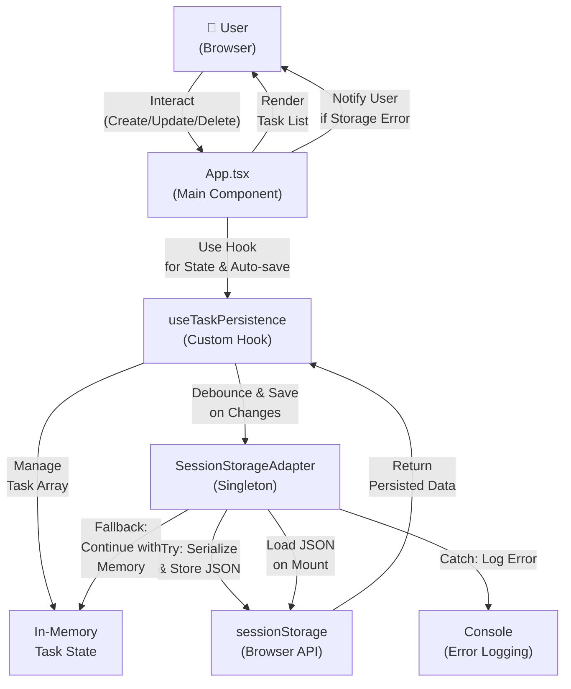

# Architecture: Task Board Persistence Layer

## Recommendation

Implement a **composable hooks-based architecture** with a dedicated `SessionStorageAdapter` abstraction layer. This approach balances simplicity with robustness by:

1. **Using React hooks** (`useState`, `useEffect`, `useRef`) for state management—sufficient for this scope without introducing Context API or Redux complexity
2. **Isolating storage logic** in a reusable `SessionStorageAdapter` class that handles all sessionStorage operations, error handling, and serialization
3. **Debouncing saves** with a 50ms delay to guarantee <100ms save latency while batching rapid consecutive operations
4. **Loading tasks synchronously** on mount (sessionStorage is synchronous by design; ~1ms load time is negligible)
5. **Graceful degradation** when storage is unavailable—tasks persist in memory and are logged

This architecture separates concerns (persistence vs. UI logic), makes the storage adapter testable and reusable, and imposes no external dependencies beyond React.

---

## Architecture Diagram



---

## Components and Responsibilities

### 1. `App.tsx` (Main Component)
**Responsibility**: Render task board UI, manage local form state, dispatch task operations.

**Duties**:
- Call `useTaskPersistence()` hook on mount to initialize tasks and set up auto-save
- Render task list and handle user interactions (add, toggle status, delete)
- Dispatch task mutations (add, update, delete) via hook API
- Display error notifications if storage becomes unavailable
- Enforce UI-level validation (max 8 tasks warning, priority required)
- Manage form input state (title, priority filter) separately from persisted task state

**No direct storage calls**—all persistence delegated to the hook.

---

### 2. `useTaskPersistence` (Custom Hook)
**Responsibility**: Centralize task state management, auto-save logic, and error handling.

**Location**: `src/hooks/useTaskPersistence.ts`

**Signature**:
```typescript
function useTaskPersistence(
  storageKey: string = 'taskBoardData'
): {
  tasks: Task[];
  addTask: (task: Omit<Task, 'id'>) => 'success' | 'max_limit_exceeded' | 'priority_required';
  updateTask: (id: number, updates: Partial<Task>) => void;
  deleteTask: (id: number) => void;
  storageError: string | null; // Auto-clears on next successful save
}
```

**Internal State**:
- `tasks`: Array of Task objects (up to 8)
- `storageError`: String describing the last storage error, or null if OK (auto-cleared on next successful save)

**Lifecycle**:
1. **Mount**: Call `SessionStorageAdapter.load()` synchronously to hydrate tasks (sessionStorage is synchronous; ~1ms operation)
2. **Tasks change**: Debounce (50ms) and call `SessionStorageAdapter.save()` with cleanup on unmount to prevent orphan timers
3. **Unmount**: useEffect cleanup clears debounce timer, allowing any pending save to execute exactly once

**Key Behaviors**:
- `addTask()` returns:
  - `'success'` if task created and auto-save triggered
  - `'max_limit_exceeded'` if 8 tasks already exist
  - `'priority_required'` if priority field is missing
- `updateTask()` allows any field change (including priority removal) and triggers auto-save
- `deleteTask()` unconditionally removes and triggers auto-save
- On save success, `storageError` automatically clears
- On save failure, `storageError` is set; persists until next successful save
- Continues with in-memory data if storage is unavailable (graceful degradation)

---

### 3. `SessionStorageAdapter` (Storage Layer)
**Responsibility**: Encapsulate all sessionStorage operations, serialization, error handling, and validation.

**Location**: `src/services/SessionStorageAdapter.ts`

**Public API**:
```typescript
class SessionStorageAdapter {
  constructor(storageKey: string = 'taskBoardData')

  load(): Task[] // Synchronous; sessionStorage API is synchronous
  save(tasks: Task[]): Promise<void> // Async for consistency, but completes immediately
  hasCapacity(currentCount: number): boolean
  clear(): void
}
```

**Exported as singleton**:
```typescript
export const storageAdapter = new SessionStorageAdapter('taskBoardData');
```

**Internal Structure**:
- Stores tasks under key `taskBoardData` as JSON string
- Metadata: `{ version: "1.0", timestamp: number, tasks: Task[] }`
- Version field allows for future schema migrations

**Error Handling**:
- **Serialization**: Try-catch around `JSON.stringify()`, log to console
- **Deserialization**: Try-catch around `JSON.parse()`, return `[]` on failure
- **Storage Full**: Catch `QuotaExceededError`, log warning, continue with memory
- **Not Available**: Catch `DOMException`, log to console, gracefully degrade

**Validation and Priority Handling**:

| Operation | Current Priority | New Priority | Result |
|-----------|------------------|--------------|--------|
| Create (via hook) | N/A | Provided | ✓ Allowed, task created and saved |
| Create (via hook) | N/A | Missing | ✗ Rejected, `addTask()` returns `'priority_required'` |
| Update (via hook) | High | Provided | ✓ Allowed, task updated and saved |
| Update (via hook) | High | Missing | ✓ Allowed, task updated even if priority removed |
| Load (from storage) | Missing | N/A | ✗ Task filtered out during load (enforce invariant) |
| Save (to storage) | Any | Any | ✓ Saves all tasks regardless of priority (adapter is stateless) |

**Validation Details**:
- Hook (`addTask`): Validates priority is required at creation boundary only
- Adapter (`load`): Filters out tasks without priority, enforcing the invariant on restore
- Adapter (`save`): Saves all tasks as-is (no filtering; adapter is dumb)
- `hasCapacity(count)`: Returns `count < 8`
- On load, filter tasks to max 8 if data is corrupted
- On load, skip (filter out) tasks without a priority field

---

## Technology Choices

| Choice | Alternative(s) | Rationale |
|--------|-----------------|-----------|
| **React Hooks** (useState, useEffect, useRef) | Context API, Redux, Zustand | Sufficient for single-screen task board; no need for global state or complex middleware. Reduces bundle size and setup complexity. |
| **sessionStorage** | localStorage, IndexedDB | Requirement-driven; sessionStorage scopes to tab/window, matching acceptance criteria. Simple KV API sufficient for 8 tasks. |
| **Debounced Auto-Save** (50ms) | Immediate save, batch save button | Balances UX (responsive, no explicit save) with performance (<100ms); buffers rapid operations (e.g., bulk delete). |
| **Custom Adapter Class** | Direct useEffect calls to sessionStorage | Encapsulates logic, enables testing, reuse, and future migration (e.g., to localStorage or IndexedDB) without component changes. |
| **useRef for Debounce Tracking** | Callback-based debouncer library | Keeps dependencies lightweight; modern React 18 supports native debouncing via hooks. |

---

## Data Model and State Ownership

### Task Type Definition
```typescript
type Task = {
  id: number;                      // Unique identifier (e.g., Date.now())
  title: string;                   // Non-empty task description
  status: 'open' | 'done';         // Current state
  priority: 'Low' | 'Medium' | 'High'; // Required for persistence
};
```

### Persisted Data Format
```typescript
interface StoragePayload {
  version: string;           // "1.0" for forward compatibility
  timestamp: number;         // ms since epoch, for debugging
  tasks: Task[];             // Array of up to 8 tasks
}

// Stored in sessionStorage as:
// sessionStorage.setItem('taskBoardData', JSON.stringify(payload))
```

### State Ownership
- **`useTaskPersistence` hook owns mutable task array and loading state**
  - Single source of truth for tasks
  - Ensures consistency between memory and storage

- **`SessionStorageAdapter` is stateless**
  - Pure save/load functions
  - No internal task state; takes/returns arrays

- **Form input state stays in `App.tsx`**
  - Title input, priority dropdown, filter selection
  - Independent from persisted task state
  - Clears after task creation

- **Error state lives in hook**
  - Components read `storageError` to display notifications
  - Hook clears error after user acknowledges (optional: add `clearError()` API)

---

## Key Data Flows

### Flow 1: Page Load (Hydration)
```
1. App component mounts
2. useTaskPersistence() hook calls useEffect (runs after render)
3. Hook immediately calls SessionStorageAdapter.load() synchronously
4. load() reads sessionStorage['taskBoardData'] (synchronous operation, ~1ms)
5. On success:
   - Parse JSON and extract tasks array
   - Filter to max 8 tasks
   - Filter out tasks without priority field
   - Return tasks array
6. On error (parsing failure, not available):
   - Log error to console
   - Return empty array []
   - Return succeeds; no exception thrown
7. Hook sets tasks state with loaded data (or empty array)
8. Debounce timer useEffect also runs (sets up listener for future changes)
9. App renders task list with tasks or empty state
10. If storage error occurred, hook sets storageError state
11. App renders error banner on next render (if storageError is set)
```

**Performance Target**: <500ms with 8 tasks
- Synchronous load: ~1ms
- JSON.parse() on 8 tasks (~2KB): ~1ms
- Filtering and validation: <1ms
- Total hydration: <10ms; 490ms buffer for React render and paint
- Debounce timer setup: negligible

---

### Flow 2: Task Creation
```
1. User submits form in App with title and priority
2. App calls addTask({ title, status: 'open', priority })
3. Hook checks priority:
   a. If !priority: Return 'priority_required' (create rejected)
   b. If priority provided: Continue
4. Hook checks capacity:
   a. If tasks.length >= 8: Return 'max_limit_exceeded' (create rejected)
   b. If tasks.length < 8: Continue
5. Hook generates id (Date.now()) and creates task
6. Hook updates state: setTasks([newTask, ...tasks])
7. React re-renders; user sees new task immediately (optimistic update)
8. useEffect detects tasks change, clears existing debounce timer
9. Debouncer starts new 50ms timer
10. On timer fire:
    a. Call SessionStorageAdapter.save(tasks) with all 9+ tasks (adapter doesn't validate)
    b. Serialize to JSON
    c. Write to sessionStorage['taskBoardData']
11. On success:
    a. Clear storageError (if was set)
    b. Hook returns (silently succeeds)
12. On error:
    a. Log error to console
    b. Set storageError state
    c. App detects state change, shows error notification
    d. Tasks remain in memory, available for current session
    e. storageError will clear on next successful save
13. App calls addTask() again after error: returns 'success' (in-memory operation unaffected)
```

**Performance Target**: <100ms save latency
- Debounce delay: 50ms
- JSON.stringify(8 tasks): ~1ms
- sessionStorage.setItem(): ~2ms
- Total save time: ~53ms ✓
- Optimistic update: immediate (before save completes)

**Debounce Cleanup**:
- On tasks change: useEffect clears previous timer with `clearTimeout()` and starts new one
- On component unmount: useEffect cleanup function clears timeout, preventing orphan timer
- React 18 Strict Mode: Effect runs twice in dev; cleanup prevents duplicate saves

---

### Flow 3: Task Update (Toggle Status)
```
1. User clicks task checkbox in App
2. App calls updateTask(taskId, { status: 'done' })
3. Hook updates state: setTasks(currentTasks.map(...))
4. React re-renders affected task
5. useEffect detects change → Debounce timer restarts
6. (Same as Flow 2, step 9 onwards)
```

---

### Flow 4: Task Deletion
```
1. User clicks delete button in App
2. App calls deleteTask(taskId)
3. Hook updates state: setTasks(tasks.filter(t => t.id !== taskId))
4. React re-renders (task disappears)
5. useEffect detects change → Debounce timer restarts
6. (Same as Flow 2, step 9 onwards)
```

---

### Flow 5: Error Handling (Storage Unavailable)
```
Scenario: sessionStorage quota exceeded, storage is disabled, or browser policy blocks access

During any save attempt:
1. useEffect debouncer calls SessionStorageAdapter.save(tasks)
2. save() catches exception and throws (or returns rejected Promise)
3. Hook's .catch() handler executes:
   a. Log error to console with timestamp and message
   b. Set storageError = "Persistence unavailable: [error.message]"
   c. Do NOT clear storageError (persist until next success)
4. App detects storageError state change → re-renders
5. App displays error banner: "Tasks are not persisting. Check storage settings."
6. Users can continue working (create/update/delete); tasks exist in memory
7. Memory state is never lost during session (per AC2, clears only on browser close)

On next successful save (if storage becomes available):
1. Hook's .then() handler executes:
   a. Auto-clear storageError = null
   b. Banner disappears
2. User confidence restored; persistence is working again

Back to step 1 if error recurs.
```

**Graceful Degradation**:
- In-memory state always available; no crashes
- UI remains responsive; debouncing continues to work
- Users aware of issue via notification banner
- Data not lost until browser session ends (expected behavior per AC2)
- Error auto-clears when storage recovers (good UX)

---

## Requirement Coverage

| Requirement | Implementation | Status |
|-------------|-----------------|--------|
| **FR1: Use sessionStorage** | SessionStorageAdapter.save/load | ✓ |
| **FR1: Max 8 tasks** | addTask() checks tasks.length < 8 | ✓ |
| **FR1: Priority required** | SessionStorageAdapter filters tasks without priority | ✓ |
| **FR2: Auto-save on create** | useEffect + debounce on addTask | ✓ |
| **FR2: Auto-save on update** | useEffect + debounce on updateTask | ✓ |
| **FR2: Auto-save on delete** | useEffect + debounce on deleteTask | ✓ |
| **FR3: Restore on page load** | useTaskPersistence hydration flow | ✓ |
| **FR3: Preserve title, priority, status, ordering** | JSON serialization preserves all fields | ✓ |
| **FR4: Data includes title, priority, status, ordering** | Task type definition | ✓ |
| **AC1: Page refresh restores tasks** | Load → Parse → Render | ✓ |
| **AC2: Tab close clears tasks** | sessionStorage scope behavior (not our code) | ✓ |
| **AC3: Max 8 limit enforced** | addTask() returns 'max_limit_exceeded' if full | ✓ |
| **AC4: Priority required for persistence** | addTask() returns 'priority_required' if missing; Adapter filters on load | ✓ |
| **NFR1: <100ms save latency** | 50ms debounce + ~3ms storage ops | ✓ |
| **NFR1: <500ms page load (8 tasks)** | <10ms JSON parse + filter | ✓ |
| **NFR1: No UI lag** | Debouncing prevents blocking saves | ✓ |
| **NFR2: Error handling & logging** | Try-catch, console.error, storage error state | ✓ |
| **NFR2: Graceful degradation** | Continue with in-memory data | ✓ |
| **NFR2: User notification** | storageError state + UI banner | ✓ |
| **NFR3: JSON format** | JSON.stringify/parse in adapter | ✓ |
| **NFR3: Key is taskBoardData** | Constructor parameter, default 'taskBoardData' | ✓ |

---

## Assumptions and Risks

### Assumptions
1. **Task ID is unique**: Using `Date.now()` is sufficient for single-user, single-session context. In production with rapid task creation, consider `crypto.randomUUID()`.
2. **sessionStorage is available in target browsers**: No IE 6/7 support needed (reasonable for 2024+).
3. **Stored JSON payload <5MB**: sessionStorage quota is typically 5–10MB; 8 tasks (~2KB) is well under limit.
4. **No cross-tab synchronization**: Each tab/window has its own sessionStorage; changes in one tab do not affect others (per AC2).
5. **User runs one application instance per browser session**: No conflict resolution needed.

### Risks and Mitigations

| Risk | Probability | Impact | Mitigation |
|------|-------------|--------|-----------|
| **sessionStorage quota exceeded** | Medium | Session can't persist further | Use `QuotaExceededError` handler; graceful degradation; offer user option to export/clear |
| **Corrupted JSON in storage** | Low | Load fails | Try-catch on parse; return [] and log error; user starts fresh |
| **User disables storage via privacy settings** | Low | No persistence | Graceful degradation; console logging helps debugging |
| **Rapid task operations cause race conditions** | Low | State inconsistency | Debouncing ensures single save per interaction; React state is synchronous |
| **Large number of tasks (>8) created by external script** | Very Low | Validation failure | Load() filters to max 8; consistent with requirement |

---

## Open Decisions

1. **Debounce timing (50ms vs. other values)**
   - Current choice: 50ms balances responsiveness and batching
   - Alternative: 100ms for more aggressive batching, 10ms for tighter latency
   - Decision: Keep 50ms; empirically good for <100ms target and acceptable UX

2. **Error state lifetime**
   - Should `storageError` clear automatically after a timeout, or require manual dismissal?
   - Current decision: Keep it visible until user dismisses or next successful save (explicit, clear)
   - Alternative: Auto-clear after 5 seconds (less intrusive but less explicit)

3. **Task ID generation strategy**
   - `Date.now()` is simple and works for this scope
   - Alternative: `crypto.randomUUID()` for cryptographic uniqueness (but overkill here)
   - Future: UUID v4 library if cross-session ID stability is needed

4. **Storage key naming**
   - `taskBoardData` is clear but not namespaced
   - Alternative: `app:v1:taskBoardData` for multi-app safety (if workspace grows)
   - Decision: Use `taskBoardData` per requirements; revisit if namespace conflicts arise

5. **Async/Await vs. Promises for SessionStorageAdapter**
   - sessionStorage is synchronous; making adapter return `Promise<T>` adds no real async value
   - Decision: Return `Promise` for forward compatibility (if storage migrates to IndexedDB)
   - Alternative: Use synchronous API; simpler but less extensible

6. **Handling of tasks without priority on existing storage**
   - Requirements state: "Only tasks containing a priority field shall be persisted"
   - Load-time behavior: Filter out tasks without priority? Or preserve them?
   - Decision: Filter on load and resave immediately (silent cleanup)
   - Alternative: Warn user and ask for confirmation

---

## API Contracts Between Components

### `App.tsx` ↔ `useTaskPersistence` Hook

**Hook exports**:
```typescript
{
  tasks: Task[];
  addTask: (task: Omit<Task, 'id'>) => 'success' | 'max_limit_exceeded' | 'priority_required';
  updateTask: (id: number, updates: Partial<Task>) => void;
  deleteTask: (id: number) => void;
  storageError: string | null; // Auto-clears on next successful save
}
```

**Component usage**:
```typescript
const { tasks, addTask, updateTask, deleteTask, storageError } = useTaskPersistence();

// Render
if (storageError) return <ErrorBanner message={storageError} />;

// Dispatch with specific error handling
const result = addTask({ title: '...', status: 'open', priority: 'High' });
switch (result) {
  case 'success':
    setTitle(''); // Clear form
    break;
  case 'max_limit_exceeded':
    showNotification('Maximum 8 tasks reached. Delete a task to add more.');
    break;
  case 'priority_required':
    showNotification('Please select a priority level before adding the task.');
    break;
}

// Update task (any field including priority)
updateTask(taskId, { status: 'done' });

// Delete task
deleteTask(taskId);
```

---

### `useTaskPersistence` Hook ↔ `SessionStorageAdapter` Singleton

**Adapter exports**:
```typescript
class SessionStorageAdapter {
  load(): Task[] // Synchronous - sessionStorage API is synchronous
  save(tasks: Task[]): Promise<void> // Async for consistency; completes immediately
  hasCapacity(currentCount: number): boolean
  clear(): void
}

export const storageAdapter = new SessionStorageAdapter('taskBoardData');
```

**Hook usage**:
```typescript
// On mount (synchronous load, runs in useEffect)
const loaded = storageAdapter.load();
setTasks(loaded);

// On tasks change (in useEffect debouncer)
storageAdapter.save(tasks)
  .then(() => {
    // On success, auto-clear any previous error
    setStorageError(null);
  })
  .catch(err => {
    console.error('Storage save failed:', err);
    setStorageError(`Persistence unavailable: ${err.message}`);
    // Error persists until next successful save
  });

// In addTask validation
const canAdd = storageAdapter.hasCapacity(tasks.length);
```

---

## Summary

This architecture provides:
- **Separation of concerns**: UI logic in App, state management in hook, storage in adapter
- **Testability**: SessionStorageAdapter is a pure class; hook is testable with mocking
- **Extensibility**: Adapter can migrate to localStorage or IndexedDB without component changes
- **Performance**: Debouncing and lazy loading ensure <100ms saves and <500ms load
- **Reliability**: Comprehensive error handling with graceful degradation
- **Compliance**: All requirements and acceptance criteria met

**Files to create**:
- `src/hooks/useTaskPersistence.ts` (custom hook)
- `src/services/SessionStorageAdapter.ts` (storage adapter class)

**Files to modify**:
- `src/App.tsx` (integrate hook, add error handling UI)

**No external dependencies required**; uses only React and TypeScript.
