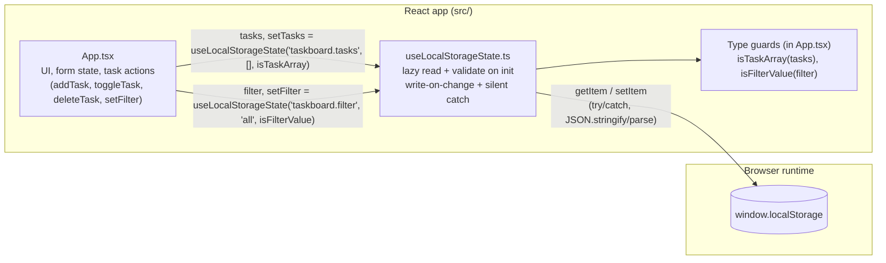
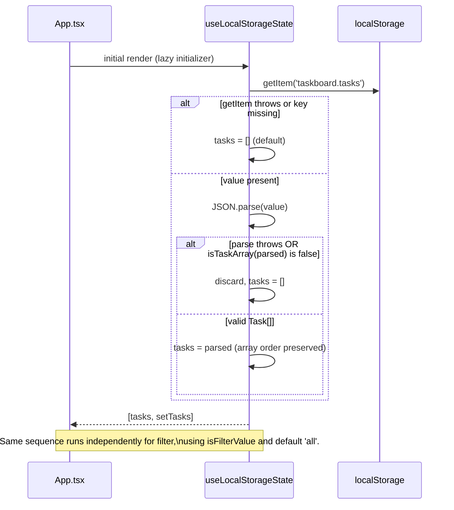
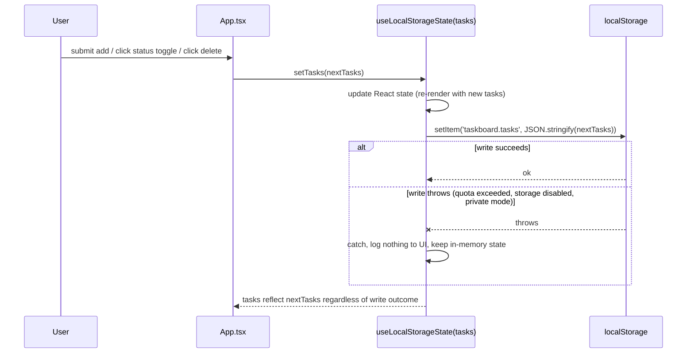

# Architecture: Task Board localStorage Persistence

## Recommendation

Add persistence with a single generic custom hook, `useLocalStorageState`, that wraps `window.localStorage` read/validate/write behavior behind the same call signature as `useState`. Use it twice in `App.tsx` — once for `tasks`, once for `filter` — instead of introducing a state-management library, a backend-style persistence layer, or duplicated `useEffect` blocks.

Rationale:

- The app only has two pieces of state that need to survive a refresh (`tasks`, `filter`). A generic hook removes duplication between the two without adding architectural weight.
- `localStorage` access is synchronous and cheap (NFR-001), so no async layer, loading state, or debouncing is required.
- The requirements explicitly exclude schema versioning/migration, cross-device sync, and bulk reset — so the design intentionally has no version-migration engine, no sync layer, and no batch-clear API.
- Keeping the hook UI-agnostic (it knows nothing about `Task`) lets the read/validate/write logic be unit-tested in isolation from React rendering.

Simpler alternative considered: inline two `useEffect` hooks directly in `App.tsx` (one that reads on mount via lazy `useState` initializers, one that writes on every `tasks`/`filter` change). This avoids adding a new file entirely. It was not chosen as the primary recommendation because it duplicates the same try/catch/JSON/validate logic twice inside the component and mixes persistence concerns into the UI component, but for a demo app of this size it is a legitimate, equally small alternative if the team prefers zero new files.

## Architecture Diagram



## Components and Responsibilities

| Component | File | Responsibility |
| --- | --- | --- |
| `App` | `src/App.tsx` | Owns UI state (form inputs), renders the board, calls `setTasks`/`setFilter` from the persistence hook on add/toggle/delete/filter actions. Unchanged in shape from today except it swaps `useState` for `useLocalStorageState` for `tasks` and `filter`, and drops `starterTasks` as the initial value. |
| `Task` type + type guards | `src/App.tsx` (colocated with the existing `Task` type) | Pure, framework-free validation: `isTask(value)`, `isTaskArray(value)`, `isFilterValue(value)`. These describe "what a valid persisted value looks like" and are the single source of truth for FR-007/FR-008 shape checks. Kept next to `Task` because they must stay in sync with that type; extracting them to a separate module is unnecessary at this size (see Decisions Confirmed in Design Review). |
| `useLocalStorageState<T>` hook | `src/hooks/useLocalStorageState.ts` (new) | Generic, reusable persistence primitive. On first render, lazily reads a given key from `localStorage`, JSON-parses it, and runs a caller-supplied validator; falls back to the caller-supplied default on any missing key, parse error, validator failure, or thrown read error. Returns a `[state, setState]` pair with the same shape as `useState`. **`setState` is the underlying `useState` setter, forwarded unchanged** — it is not wrapped — so it fully supports both the direct-value form and the functional-updater form (`setState(prev => next)`) that `App.tsx`'s existing `addTask`/`toggleTask`/`deleteTask` handlers already rely on. Persistence write logic runs in a **separate `useEffect` keyed on `[key, state]`**, executed after the state update commits, serializing and writing to `localStorage` inside a `try/catch` that swallows write errors silently. **The write never runs inside the `setState` updater function itself** — persistence I/O is deliberately kept out of the render/reducer phase so it stays side-effect-free and safe under `<StrictMode>`'s intentional double-invocation of updater functions. Contains no knowledge of `Task` or `filter` — it only knows "key, default value, validator." |
| `window.localStorage` | Browser API | Durable key/value store scoped to origin + browser profile. Treated as an untrusted, possibly-unavailable I/O boundary — every access goes through the hook's try/catch. |

State ownership:

- **React state (`tasks`, `filter`) is the single source of truth during a session.** All reads (filtering, counts, rendering) happen against React state, never against `localStorage` directly, so persistence failures never affect in-session behavior (NFR-002).
- **`localStorage` is a one-way mirror of React state**, updated after every committed state change. The only direction data flows *from* storage *into* React state is the one-time read at initial mount.
- **The hook's `setState` is React's own state setter, unwrapped.** No side effects (including `localStorage.setItem`) run inside a `setState` updater function; all persistence I/O happens in a `useEffect` that observes the committed state value. This is a deliberate decision (see Design Review, Finding D-01) to avoid the anti-pattern of side effects inside state updaters, which is unsafe under `<StrictMode>` and concurrent rendering.
- **Form draft state (`title`, `priority` input)** stays local, ephemeral `useState` in `App.tsx` — it is not part of the persisted `Task`/filter model and is out of scope for this story.

## Technology Choices

| Choice | Why | Simpler alternative |
| --- | --- | --- |
| Native `window.localStorage` via a small custom hook | Matches BR-005/FR-012 (no backend), synchronous API satisfies NFR-001, zero new dependencies. | None needed — this is already the simplest option that meets the requirements. |
| One generic hook (`useLocalStorageState`) reused for both `tasks` and `filter` | Avoids writing the same read/validate/write/try-catch logic twice; keeps the get/set call sites in `App.tsx` looking like ordinary `useState`. | Two separate inline `useEffect`/lazy-`useState` blocks directly in `App.tsx`, one per field. Viable for this app's size, but duplicates logic and is harder to unit test in isolation. |
| Runtime type guards (`isTaskArray`, `isFilterValue`) instead of a schema library (e.g., zod) | The shape is small and fixed (4 fields, 2 enums); hand-written guards are a few lines and have zero dependencies. | A schema-validation library — rejected as over-engineering for a shape this small and static. |
| No state-management library (Redux/Zustand/etc.) | Only two state values need persistence; React's built-in `useState`/`useEffect` composed into one hook is sufficient. | N/A — introducing a library would be over-engineering per the stated constraints. |
| No versioned storage keys / migration layer | Requirements explicitly exclude schema versioning and migration (Out of scope; Assumptions). | A `:v1` key suffix was considered and rejected for now; see Decisions Confirmed in Design Review. |

## Data Model and State Ownership

Persisted `Task` shape (unchanged from the existing `src/App.tsx` type — no new `order` field is introduced):

```ts
type Task = {
  id: number;
  title: string;
  status: 'open' | 'done';
  priority: 'Low' | 'Medium' | 'High';
};
```

- **Ordering (FR-011)** is represented positionally — the array's element order *is* the task order. `JSON.stringify`/`JSON.parse` preserve array order, so no explicit `order`/`index` field is needed; the persisted array is written and read back in the same sequence it exists in React state.
- **Filter shape**: `'all' | 'open' | 'done'`, stored as a JSON string (`JSON.stringify('all')` etc.) so both persisted values go through the exact same generic read/write path in the hook.

Storage keys (namespaced to avoid collisions with any other app at the same origin, per the requirements' Assumptions):

| Data | Key | Value shape |
| --- | --- | --- |
| Task list | `taskboard.tasks` | JSON array of `Task` |
| Active filter | `taskboard.filter` | JSON string, one of `'all' \| 'open' \| 'done'` |

No versioning/migration metadata is stored (explicitly out of scope). The optional `:v1` key-suffix naming convention was considered and is **not** adopted for this story (see Decisions Confirmed in Design Review); plain keys are used.

State ownership summary:

| State | Owner | Persisted? | Lifetime |
| --- | --- | --- | --- |
| `tasks` | `App` via `useLocalStorageState` | Yes (`taskboard.tasks`) | Survives refresh and browser restart (same browser/device) |
| `filter` | `App` via `useLocalStorageState` | Yes (`taskboard.filter`) | Survives refresh and browser restart (same browser/device) |
| `title`, `priority` (form draft) | `App` via plain `useState` | No | Resets on every add / on refresh |

## Key Data Flows

### Startup / refresh (restore with fallback)



This satisfies FR-003/FR-004 (restore when valid), FR-005/FR-006 (empty list / `'all'` default when absent), FR-007/FR-008 (discard malformed data without throwing), FR-010 (read failures fall back to defaults), and FR-011 (no re-sorting).

### Task mutation (add / complete / reopen / delete) → persist



Note on timing: the `setItem` step above runs inside a `useEffect` scheduled after the state update commits — it is not executed synchronously inside the `setTasks` call. This keeps the write out of the render/reducer phase (see State ownership, above) at the cost of a small, accepted timing gap between "state updated" and "write flushed"; see Assumptions and Risks.

This satisfies FR-001 (write full list on every successful mutation), FR-009 (silent write-failure handling), AC-003, AC-008, and NFR-002 (UI stays usable even if the write fails).

### Filter change → persist

Identical shape to the mutation flow above, but triggered by `setFilter(nextFilter)` and writing to `taskboard.filter`. Satisfies FR-002, AC-002.

### Malformed-data / storage-unavailable edge cases

- Malformed JSON or wrong shape under `taskboard.tasks` → discarded, `tasks` initializes to `[]`, no error shown (FR-007, AC-006).
- Malformed value under `taskboard.filter` (e.g., not one of the three literals) → discarded, `filter` initializes to `'all'` (FR-008, AC-007).
- `localStorage` entirely unavailable (private browsing, disabled storage) → every read attempt throws and is caught, falling back to defaults; every write attempt throws and is caught, silently no-op; the board remains fully usable in memory for the session (FR-009, FR-010, AC-008, NFR-002).

## Requirement Coverage

| Requirement | How the architecture satisfies it |
| --- | --- |
| FR-001, AC-003 | Write-on-change effect inside `useLocalStorageState`, driven by `setTasks` from every mutation handler. |
| FR-002, AC-002 | Same hook reused for `filter`, driven by `setFilter`. |
| FR-003, FR-004, AC-001 | Lazy read-and-validate on initial mount, returned as the hook's initial state. |
| FR-005, FR-006, AC-004, AC-005, BR-001 | Missing key (or failed read) falls back to `[]` / `'all'`; `starterTasks` is no longer used as the initial value passed to `useLocalStorageState`. |
| FR-007, FR-008, AC-006, AC-007 | `isTaskArray` / `isFilterValue` type guards run after `JSON.parse`; any failure discards the value and uses the default, inside the same try/catch that also handles parse errors. |
| FR-009, FR-010, AC-008, NFR-002 | All `localStorage.getItem`/`setItem` calls are wrapped in try/catch inside the hook; failures never propagate to the UI or throw unhandled errors. |
| FR-011 | Order is preserved positionally in the persisted array; no sorting step exists anywhere in the read or write path. |
| FR-012, BR-002, BR-005, AC-009 | All persistence stays inside `window.localStorage`; no network calls, no auth, no sync mechanism are introduced. |
| BR-003 | No bulk clear/reset API is added; `deleteTask` remains the only removal path, unchanged. |
| BR-004 | Write errors are caught and ignored; no UI element surfaces a persistence error. |
| NFR-001 | `localStorage` calls are synchronous and cheap; the write runs in a post-commit `useEffect` (see Key Data Flows) rather than an async layer, and no loading indicator is introduced. |

## Assumptions and Risks

- **Key names** (`taskboard.tasks`, `taskboard.filter`) are an implementation choice, as the requirements leave this to the implementer. They are namespaced with a `taskboard.` prefix to reduce collision risk with other apps at the same origin.
- **StrictMode double-invocation**: React's `<React.StrictMode>` (already used in `main.tsx`) invokes lazy initializers twice in development. This is safe here because the hook's read path is a pure, idempotent read — running it twice produces the same result and has no side effects.
- **Write-after-restore no-op**: because the write effect is keyed on the `tasks`/`filter` state value, it also fires once right after the initial restore, re-writing the same data back to `localStorage`. This is harmless (idempotent) but technically an extra write on every load; not eliminated here to avoid adding an "is this the first render" guard, per the instruction to keep the design minimal. See Decisions Confirmed in Design Review.
- **Multi-tab writes**: if the app is open in two tabs of the same browser, the last tab to write "wins," per the requirements' explicit note that this is unaddressed and untested by this story. No cross-tab coordination (e.g., `storage` event listener) is added.
- **No user-facing indication of persistence failure**: per BR-004, this is required behavior, but it also means a user in a fully storage-disabled environment (e.g., strict private browsing) gets no signal that their work will not survive a refresh. This is an accepted risk per the confirmed requirements, not a defect to fix here.
- **Write-timing edge case (post-commit effect vs. instantaneous unload)**: because the write runs in a `useEffect` after commit rather than synchronously inside the triggering event handler, there is a theoretical edge case where an instantaneous tab close/crash immediately after the last action could occur before the effect flushes, losing that single last write. This is accepted as consistent with NFR-001 (standard synchronous `localStorage` calls are sufficient; no flush-on-unload mechanism is required) and cannot be verified without a real browser; it is not a defect in this design.
- **`localStorage` access itself can throw, not just its methods**: in some restricted environments (e.g., certain private-browsing modes), reading the `window.localStorage` property can throw a `SecurityError` before `.getItem`/`.setItem` is even called. The implementation must wrap the property access itself inside the `try` block, not just the method call, or a read/write failure could escape the catch and violate FR-009/FR-010.

## Decisions Confirmed in Design Review

The following were listed as open decisions and have been resolved (see `design-review.md` for full rationale); none require further discussion before implementation:

- **First-render write-back guard**: Not added. The redundant "write back identical data" effect run immediately after restore (and its `<StrictMode>`-doubled dev-only variant) is harmless because the write is idempotent. Adding an `isFirstRender` ref guard would add complexity with no functional benefit, contrary to the smallest-architecture goal.
- **Developer-console logging of persistence failures**: Not added by default. `console.warn` in the catch blocks would not violate BR-004 (which governs user-facing surfaces, not developer tools), but it is not required by any requirement and is left as a future, optional enhancement rather than part of this design.
- **Location of type guards**: Kept colocated with the `Task` type in `App.tsx` for now. Extraction into a separate module is deferred until the component grows enough to justify it (YAGNI).
- **`:v1` key-naming convention**: Not adopted. Plain keys (`taskboard.tasks`, `taskboard.filter`) are used, consistent with versioning/migration being explicitly out of scope.

## Residual Open Items (not blocking, tracked for awareness only)

- Exact wording/placement of unit tests for the hook and type guards is left to the implementation phase; no test framework is currently configured in `package.json`.
